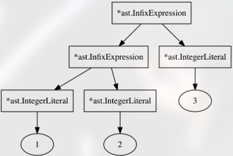

Parsing Expressions
----

Parsing expressions does has some challengers.

### Operator Precedence

lets say we want to parse the below arithmetic expression:

```js
5 * 5 + 10
```

after parsing this what we want is a AST that represents the expression like below

```js
((5 * 5) + 10)
```

> This is to say 5 * 5 needs to be 'deeper' in the AST and evaluated earlier before addition
  in order to produce AST that looks like this, parser needs to know about operator precedences
  where * is higher than +

but there are other cases where this is important

---
```js 
5 * (5 + 10) ```

here the parenthesis group together the `5 + 10` and give `precedence bump` 
the addition now has to be evaluated before the multiplication. 

---
```js
-5 - 10
```
when expressions tokens of the same type appear in multiple possitions.
here the `-` operator appears at the beginning of the expression as a prefix operator,
then there is an infix operator in the middle. 

below is a variation of the same challenge

```js
5 * (add(2, 3) + 10)
```

---

Expressions in Monkey
---

in monkey programming language everything besides let and return statement is an expression.
these can come in different varities

- prefix operators:
```js
-5 
!true
!false
```
- infix operators (or "binary operators"):
```js
5 + 5
5 - 5
5 / 5
5 * 5
```
- basic arithmetic operators and comparison operators:
```js
foo == bar
foo != bar
foo < bar
foo > bar
```

- parentheses to group expressions and influence order of evaluation:
```js
5 * (5 + 5)
((5 + 5) * 5) * 5
```
- call expressions
```js
add(2, 3)
add(add(2, 3), add(5, 10))
max(5, add(5, (5 * 5)))
```
- Identifiers are expressions too:
```js
foo * bar / foobar
add(foo, bar)
```
- Functions in Monkey are first-class citizens, function literals are expressions:
```js
let add = fn(x, y) { return x + y };

// here we use a function literal in place of an identifier:
fn(x, y) { return x + y }(5, 5)
(fn(x) { return x }(5) + 10 ) * 10
```
- if expressions
```js
let result = if (10 > 5) { true } else { false };
result // => true
```
---

# Top Down Operator Precedence (or: Pratt Parsing)

References 
- https://journal.stuffwithstuff.com/2011/03/19/pratt-parsers-expression-parsing-made-easy/
- https://crockford.com/javascript/tdop/tdop.html

> The parsing approach described by all three, which is called Top Down 
Operator Precedence Parsing, or Pratt parsing, was invented as an alternative
to parsers based on context-free grammars and the Backus-Naur-Form.

#### This is also the main difference:

insted of associateing parsing functions with rules, Praat associates these functions
with single token type. 

this main part of this idea is that each token type can have two parsing functions 
associated with it. depending on the token position - infix or prefix

---


### Terminology

- A *prefix operator* is an operator "in front of" its operand eg: `--5`
    - here the operator is `--`, the operand is the int `5` operator is the prefix position

- A *postfix operator* is an operator "after" its operand eg: `foobar++`
    - operator is `++`, the operand is `foobar`. the operator is in the postfix possition

- A *infix operators* sits between its operands, eg: `5 * 8`
    - the `*` operator sits in the infix position between two int `5` and `8`. 
    - infix operators appear in *binary expressions* - where the operator has two operands

- *operator precedence* (order of operations), which priority do different operators have. 
eg : `5 + 5 * 10`
    - the result for this is `55` not `100`. that's because `*` operator has higher precedence (rank)
    - its more important than the `+` operator. 
    - `*` gets eval before the `+` operator


> These are all basic terms: prefix, postfix, infix operator and precedence. 
But it’s important that we keep these simple definitions in mind later on,
where we’ll use these terms in other places.


# Implementing the Pratt Parser

Pratt parsers main idea is the association of parsing functions (semantic code) with token types.
Whenever this token type is encountered, the parsing functions are called to parse the
appropriate expression and return `AST` node represents it. Each token type can have up to two
parsing functions associated with it.  depending on whether the token is found
in a prefix or an infix possition.

```go
// parser/parser.go

type (
    prefixParseFn func() ast.Expression
    infixParseFn  func(ast.Expression) ast.Expression
)
```

## Integer Literals

first we have to implment the `parseIntegerLiteral` methord

```go
func (p *Parser) parseIntegerLiteral() ast.Expression {
	lit := &ast.IntegerLiteral{Token: p.curToken}
	value, err := strconv.ParseInt(p.curToken.Literal, 0, 64)

	if err != nil {
		msg := fmt.Sprintf("could not parse %q as integer", p.curToken.Literal)
		p.errors = append(p.errors, msg)
		return nil
	}

	lit.Value = value
	return lit
}
```

this func takes the responsibility to parse the integer value. then we can register this parser
in our `Parser`

```go
func New(l *lexer.Lexer) *Parser {
	p := &Parser{
		l:      l,
		errors: []string{},
	}

	// Read two tokens, so curToken and peekToken are both set
	p.nextToken()
	p.nextToken()

	// `New() func initiate the `prefixParseFns` map on `Parser`
	// and register a parsing function;
	// if we enconter a token type of `token.IDENT` the parsing function to call
	// is `parseIdentifier` a methord defined in `Parser`
	p.prefixParseFns = make(map[token.TokenType]prefixParseFn)
	p.registerPrefix(token.IDENT, p.parseIdentifier)
	p.registerPrefix(token.INT, p.parseIntegerLiteral)

	return p
}
```

in our `parseExpression` methord we basically get this prefixparser in this case it will be 
`parseIntegerLiteral` and we use it to parse the statement
```go
func (p *Parser) parseExpression(precedence int) *ast.Expression {
	// take the register prefix parser functions we register then when `New()`
	// is called and we call that parser function
	prefix := p.prefixParseFns[p.curToken.Type]

	if prefix == nil {
		return nil
	}

	leftExp := prefix()

	return &leftExp
}
```
---

# Prefix Operators

there are two prefix operatos in our lang. `!` and `-`. their usage is pretty much the same
with other langauges

```js
-5;
!foobar;
5 + -10
```
the usage is same as other languages

```<prefix operator> <expression>;```

any expression can follow a prefix as operand. for example:
```js
!isGreaterThanZero(2);
5 + -add(5, 5);
```
that means that `AST` node for a prefix operator has to be flexible enough to point any expression
as its operand.


The register events are below

```go
func New(l *lexer.Lexer) *Parser {
    // ...
	p.prefixParseFns = make(map[token.TokenType]prefixParseFn)
	p.registerPrefix(token.BANG, p.parsePrefixExpression)
	p.registerPrefix(token.MINUS, p.parsePrefixExpression)

    // ...
}
```

as you can see for the token types `token.BANG` and `token.MINUS` we do call the `parsePrefixExpression`
below is the impl for the `parsePrefixExpression`

```go
func (p *Parser) parsePrefixExpression() ast.Expression {
	// builds an `AST` node, in this case `*ast.PrefixExpression`. but then it advances
	// our tokens by calling `p.nextToken()`
	//
	// when `parsePrefixExpression` is called, `p.curToken` is either of type token.BANG or token.MINUS
	// to parse the prefix expression like `-5` more than one token has to be "consumed",
	// so after using `p.curToken` to build a *ast.PrefixExpression node, then the methord
	// advances the tokens and call `p.parseExpression(PREFIX)` again. this time with
	// precedence of PREFIX
	expression := &ast.PrefixExpression{
		Token:    p.curToken,
		Operator: p.curToken.Literal,
	}

	p.nextToken()
	expression.Right = p.parseExpression(PREFIX)
	return expression
}
```

as you can see here we basically builds `AST` node in this case  `*ast.PrefixExpression`. but
then we advance our tokens by calling `p.nextToken()`

if we take `-5` for example, first it will create `*ast.PrefixExpression` and then it advance
and call parseExpression for the next token which will then create `*ast.IntegerLiteral`

when calling `parseExpression` we do parse precedence as `PREFIX`

----

# Infix Operators

Next up we’re going to parse these eight infix operators:
```js
5 + 5;
5 - 5;
5 * 5;
5 / 5;
5 > 5;
5 < 5;
5 == 5;
5 != 5;
```

its not just this 5 we can use any expressions to the left and right of the operator

`<expression> <infix operator> <expression`

> Because of the two operands (left and right) these expressions are sometimes called "binary expressions"

---

# How Pratt Parsing Works

The algorithm behind the `parseExpression` methord and its combination of parsing functions
and precedences is fully described by Vaughan Pratt in his "Top Down Operator Precedence" paper.

> Pratt doesn’t use a Parser structure and doesn’t pass around methods defined on *Parser. 
He also doesn’t use maps and, of course, he didn’t use Go. 
His paper predates the release of Go by 36 years. And then there are naming differences: 
what we call prefixParseFns are "nuds" (for "null denotations") for Pratt. 
`infixParseFns` are "leds" (for "left denotations").

### How does this work?

lets say we want to parse below expression statement :
```js
1 + 2 + 3;
```
what we want here is an `AST` that (serialized as a string) looks like below
```js
((1 + 2) + 3)
```
the AST needs to have two `*ast.InfixExpression` nodes. The `*ast.InfixExpression`
higher in the tree should have int `3` as the `Right` child node. 

the `Left` child node needs to be other `*ast.InfixExpression`. second node needs to have the
int `1` and `2` as its `Left` and `Right` child nodes. 

[]

this is exactly what our parser outputs when it parses `1 + 2 + 3`.
